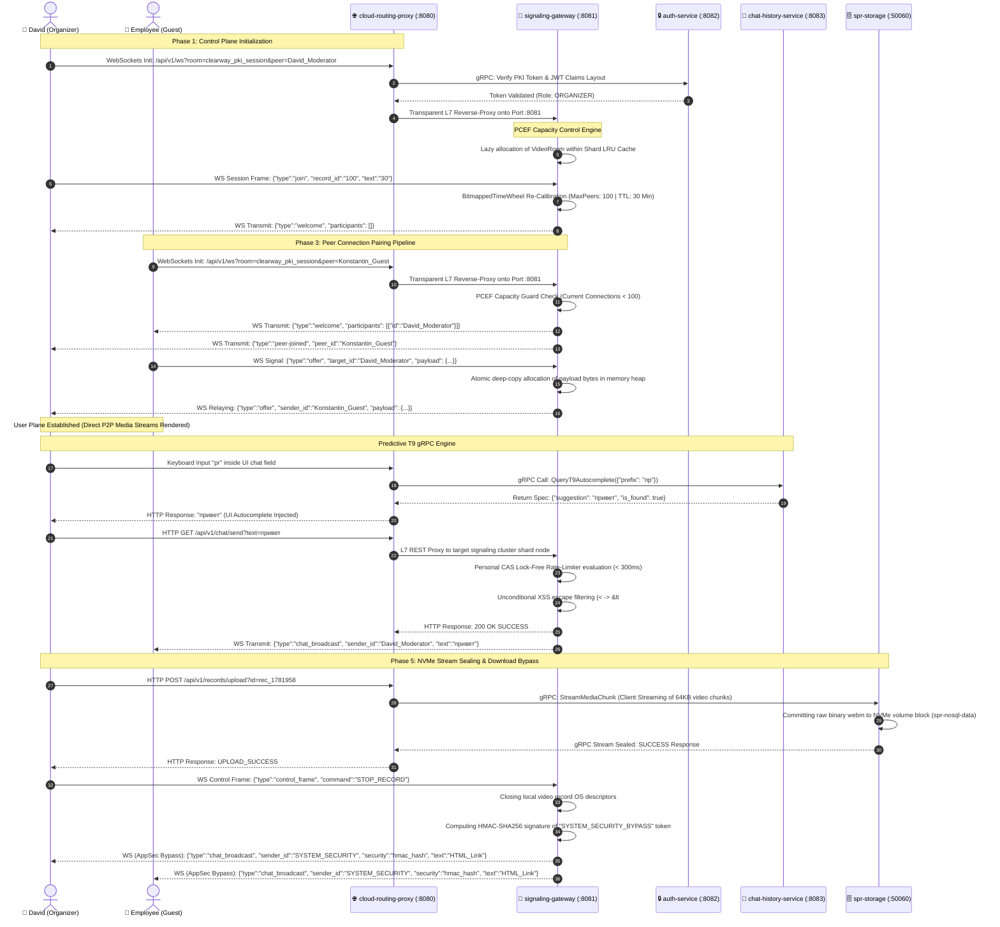

# 🪐 CLEARWAY PKI WEBRTC FULL-MESH PLATFORM (OPERATOR CLASS)

Distributed high-performance operator-class software B2B videoconferencing platform. The architecture is engineered using strict separation of **Control Plane** (signaling and room orchestration), **User Plane** (direct WebRTC media streaming), and **Data Plane** (gRPC NoSQL storage, predictive T9 engines, and cryptographic payload validation).

Распределенная высокопроизводительная программная b2b-платформа видеоконференцсвязи операторского класса. Архитектура построена по принципу строгого разделения плоскостей **Control Plane** (сигнализация и оркестрация комнат), **User Plane** (прямой медиа-обмен WebRTC) и **Data Plane** (gRPC NoSQL-хранилище, предикативные T9-сервисы и контур криптографической верификации).

---

## 🛠️ DEPLOYMENT & LAUNCH GUIDE / РЕГЛАМЕНТ РАЗВЕРТЫВАНИЯ

> 🇺🇸 **EN:** detailed manual for cold initialization, compilation of modules via `go.work` and launching all 5 containers within isolated Docker mesh networks is aggregated here: **[LAUNCH.md](LAUNCH.md)**.
> 
> 🇷🇺 **RU:** подробный регламент холодной инициализации, сборки модулей `go.work` и запуска 5 контейнеров в изолированном Docker-окружении находится в техническом руководстве: **[LAUNCH.md](LAUNCH.md)**.
> 
> 📑 Architectural SRS overviews and component charts are tracked inside the index map: **[docs/navigation.md](docs/navigation.md)**.

---

## 📐 1. SYSTEM TOPOLOGY & INTERACTION CONTOURS (DATA FLOW)

The cluster functions within the virtual isolated Docker network bridge `clearway-mesh-network` and aggregates 5 microservices communicating via HTTP, full-duplex WebSockets, and high-performance binary gRPC frames.

Система функционирует внутри виртуальной сети Docker `clearway-mesh-network` и состоит из 5 скоординированных микросервисов, общающихся по протоколам HTTP, WebSockets и высокопроизводительному бинарному gRPC.

### 📊 Comprehensive Sequence Diagram / Подробная диаграмма последовательности вызовов

---

## 🎰 2. CORE TECHNOLOGICAL CONTOURS / КЛЮЧЕВЫЕ ТЕХНОЛОГИЧЕСКИЕ КОНТУРЫ

### 🎰 2.1 PCEF Capacity Subsystem & Bitmapped Time Wheel
* 🇺🇸 **EN:** to strictly safeguard the signaling gateway's RAM from OOM attacks and heavy room overflows, a thread-safe **`BitmappedTimeWheel`** scheduler is deployed. The 300-minute time wheel is packed into a compact array of `slots [5]uint64` (320 bits). Setting a bit to `1` takes exactly 1 CPU cycle via bitwise OR: `tw.slots[wordIdx] |= (1 << bitIdx)`. When a pause (`SET_PAUSE`) is triggered, the room metadata is evacuated to a security buffer slot for 5 hours. Upon resumption (`RESUME_CONFERENCE`), the janitor compute microsecond prostration delta via `time.Since(room.CreatedAt)`, adjusting the deadline timestamp to protect user mesh sessions.
* 🇷🇺 **RU:** для жесткой защиты оперативной памяти шлюза сигнализации от атак переполнения (DoS) и утечек (OOM) развернут планировщик **`BitmappedTimeWheel`**: 300-минутное кольцо времени спроектировано в виде компактного массива `slots [5]uint64` (320 бит). Взвод бита в положение `1` выполняется за 1 такт процессора через побитовое ИЛИ: `tw.slots[wordIdx] |= (1 << bitIdx)`. При активации команды `SET_PAUSE` комната выметается из текущего минутного слота и эвакуируется в страховую 300-ю ячейку на 5 часов. При возобновлении (`RESUME_CONFERENCE`) Janitor-демон вычисляет чистый простой сессии через дельту `time.Since(room.CreatedAt)`, сдвигает дедлайн `room.UpdatedAt` и возвращает комнату в будущий слот Колеса Времени, полностью исключая Race Conditions.

### 🛡️ 2.2 AppSec Chat Pipeline & Cryptographic HMAC Bypass
* 🇺🇸 **EN:** chat transactions are secured via a dual-path pipeline. The **Slow-Path** handles untrusted client traffic: messages are sliced to 1000 characters maximum, HTML tokens are sanitized (`<` and `>` replaced via `&lt;` / `&gt;`), and high-frequency flood is negated via a Lock-Free CAS rate limiter (300ms slot within `PeerSession`). The **Fast-Path** context handles trusted system infrastructure records payloads: downloadable links are signed via **HMAC-SHA256** using a symmetric secret key. When traversing the gateway socket loop, the signature is evaluated via `hmac.Equal`. Valid tags bypass XSS filters, allowing native HTML link execution inside browser layout trees without rendering `undefined` states.
* 🇷🇺 **RU:** контур чата защищен по двухмагистральной b2b-схеме. **Slow-Path** обрабатывает пользовательский трафик: сообщения обрезаются до 1000 символов, HTML-теги санитизируются в `&lt;` и `&gt;`, а флуд блокируется Lock-Free CAS ограничением частоты (лимит 300мс внутри `PeerSession`). **Fast-Path** контур обрабатывает инфраструктурные сообщения: ссылки подписываются сервером через **HMAC-SHA256** от секретной константы. При проходе через сокет-цикл шлюз сигнализации сверяет подпись токена `incoming.Security` через `hmac.Equal`. При успешном крипто-проходе **XSS-фильтр отключается**, предотвращая появление ошибок `undefined` и экранирование тегов при рендеринге HTML в UI.

### 🗄️ 2.3 High-Performance Data Plane & Storage Cascade
* 🇺🇸 **EN:** video chunks are sliced down to 64KB buffers on the client side and pushed via HTTP POST requests to the L7 Gateway. The proxy instantly passes frames via a gRPC stream context directly into `spr-storage` (Port `:50060`) with zero куча allocations. Monolithic WebM binaries are written straight into the persistent docker volume `spr-nosql-data`. File download is managed by a fail-safe multi-path locator layout `HandleRecordsDownload`, unlocking byte-accurate `Accept-Ranges` stream rendering inside browser containers.
* 🇷🇺 **RU**: кадры видеозаписи нарезаются на чанки по 64 КБ на стороне клиента и летят HTTP POST запросом в прокси. Прокси-сервер по gRPC-каналу транслирует их в spr-storage на порт :50060 с нулевым выделением памяти в куче (Zero-Allocation). Монолиты WebM сохраняются на персистентный разделяемый Docker-том spr-nosql-data. Скачивание реализовано через каскадный мульти-путевой локатор HandleRecordsDownload с поддержкой Range-Streaming побайтовой перемотки видео в браузере.
