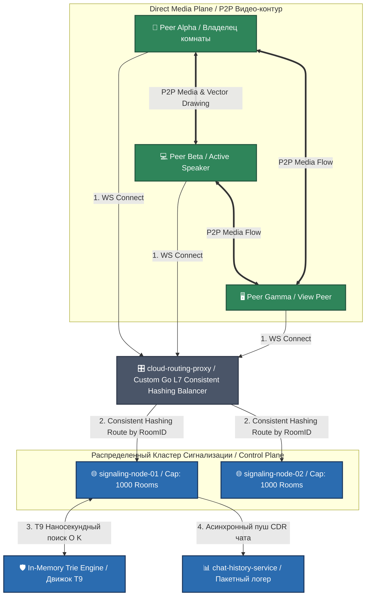

# 🏛️ Distributed WebRTC P2P Mesh Signaling Platform with Trie-T9 Core

[RU] Данный модуль представляет собой высоконагруженную, отказоустойчивую сигнальную платформу для организации распределенных P2P (Peer-to-Peer) видеоконференций по топологии Mesh. Архитектура спроектирована на базе неблокирующих WebSockets (Go 1.26.4 workspaces) со встроенным Highload-движком Т9 автодополнения чата на базе префиксных деревьев Trie.

[EN] This module implements a highly concurrent, fault-tolerant signaling platform for orchestrating distributed P2P (Peer-to-Peer) video conferences utilizing a Mesh topology. The architecture is driven by non-blocking WebSockets (Go 1.26.4 workspaces) integrated with a high-throughput T9 chat autocomplete engine powered by Trie prefix trees.

---

## 🗺️ System Topology & Cluster Architecture / Архитектурная топология системы

---

## 📋 Technical Requirements Specification (SRS) / Техническое ТЗ проекта

### 1. Custom L7 Load Balancer & Consistent Hashing / Умная балансировка кластера (Req. 1)
* **[RU]** Для горизонтального масштабирования платформы разработан кастомный балансировщик **`cloud-routing-proxy`** на чистом Go. Вместо тяжелого Nginx он использует алгоритм **Последовательного хэширования (Consistent Hashing с виртуальными узлами)**. Трафик участников конкретной комнаты жестко изолируется и маршрутизируется на одну целевую ноду сигнализации по хэшу `RoomID` [🧠]. Предельный лимит комнат на ноду (например, 1000) жестко регулируется через `config.yaml` [🧠]. При перегрузке балансировщик динамически перераспределяет входящие сессии на свободные инстансы кластера [🧠].
* **[EN]** For horizontal scaling, a custom **`cloud-routing-proxy`** Layer 7 load balancer is written in pure Go. Replacing standard Nginx overhead, it deploys a **Consistent Hashing algorithm with virtual nodes**. Client websocket traffic for any explicit room is strictly bound and routed to a single signaling node based on the hashed `RoomID` key, ensuring zero cross-node synchronization latency. Hard room capacity thresholds per node (e.g., 1000) are governed via `config.yaml`.

### 2. Multi-Peer Room Management & Signaling Control / Сигнальное управление комнатами (Req. 2)
* **[RU]** Владелец комнаты инициализирует сессию, задавая временные рамки (лимит продления до 5 часов), пароль, HMAC-токен доступа и лимит участников (до 100 человек) [🧠]. Ссылка на инвайт рассылается встроенным асинхронным воркером на Email [🧠]. Диспетчеризация команд отключения микрофонов, видеопотоков, демонстраций экранов и блокировок чата осуществляется через **Управляющие WebSocket-фреймы (Control Frames)**. Шлюз проверяет статус токена модератора за время $O(1)$ в оперативной памяти и веерно рассылает сигнальную команду участникам сессии, принудительно мутируя медиа-дорожки на стороне WebRTC API их браузеров [🧠].
* **[EN]** The room owner provisions a session by defining explicit time constraints (extension caps up to 5 hours), passphrases, HMAC access tokens, and peer volume limits (up to 100 clients). Invite URLs are dispatched via automated asynchronous email workers. Dispatching of mute/unmute commands, video track toggles, screen-share permissions, and chat bans is driven via **WebSocket Control Frames** validated within $O(1)$ complexity in RAM.

### 3. P2P Mesh Media Plane & Smart UX/UI layouts / Медиа-контур и умный интерфейс (Req. 3)
* **[RU]** Видеотрафик циркулирует строго **напрямую между браузерами по зашифрованным DTLS-SRTP туннелям (Mesh)**, освобождая сервер от нагрузки на транскодирование. На уровне сигнального протокола SDP поддерживается:
  * **Режим Спикера (Active Speaker Detection):** динамическое увеличение окна говорящего участника на 2/3 экрана на основе метаданных аудио-активности VAD, сдвигая остальных участников в правый пролистываемый блок [🧠].
  * **Коллаборативное Рисование:** передача векторных координат линий и стрелок поверх окна демонстрации экрана в реальном времени.
  * **SDP Мутация & Quality Auto-Scaling:** принудительное шумоподавление (`noiseSuppression`) и динамический даунгрейд разрешения потоков с 1080p до 360p для пассивных участников при перегрузке каналов связи [🧠].
* **[EN]** Media streams circulate strictly **peer-to-peer via encrypted DTLS-SRTP tunnels (Mesh topology)**. At the signaling SDP layer, the platform enforces:
  * **Active Speaker Detection:** dynamic peer layout expansion up to 2/3 of the workspace based on real-time VAD telemetry, shifting passive streams into a scrollable right panel.
  * **Collaborative Drawing:** real-time routing of vector coordinate streams for arrows and lines over active screen shares.
  * **SDP Mutation & Quality Auto-Scaling:** server-enforced noise suppression and dynamic resolution downgrades (from 1080p to 360p) for passive viewers under intense network jitter constraints.

### 4. Reactive Cache Eviction & Idle State Backoff / Каскадный кэш и Тайм-ауты (Req. 4)
* **[RU]** Управление комнатами в RAM памяти ноды переведено на кастомный **Reactive LRU Cache с каскадным сжатием хвоста (Tail-to-Head Cascade Eviction)** [0.1.1, 🧠]. Если в комнате нет пользователей более 30 минут, кэш лениво за время $O(1)$ вычищает сессию из памяти с принудительным вызовом `runtime.GC()` [🧠]. 
* **[RU]** Если в комнате нет активности 30 минут при живых участниках, активируется **Воркер оповещений с Экспоненциальным Бэкоффом (Exponential Backoff Janitor)** [🧠]. Он 3–5 раз шлет модератору предупреждающий WebSocket-фрейм `STIMULUS_ALERT`. При отсутствии реакции комната принудительно закрывается [🧠]. В режиме **Паузы** микрофоны и камеры блокируются, а трансляция экрана снижает фреймрейт до 1 кадра в 5 секунд (**Muted Keyframes**) для 95% экономии трафика сервера, а запись сессии на клиенте автоматически ставится на паузу [🧠].
* **[EN]** Memory management inside each signaling node is governed by a **Reactive LRU Cache featuring dynamic Cascade Eviction** [0.1.1, 🧠]. If a room remains empty for 30 minutes, the cache lazily evicts the state within $O(1)$ limits followed by an explicit `runtime.GC()` execution.
* **[EN]** If a session remains idle for 30 minutes while clients are attached, an **Exponential Backoff Janitor Worker** is triggered. It fires warning websocket frames `STIMULUS_ALERT` to the moderator 3-5 times under exponential time steps before forcing room termination. Under a **Pause state**, mic/camera tracks are blocked, screen-share streams drop to 1 frame per 5 seconds (**Muted Keyframes**) ensuring a 95% bandwidth drop, and client-side recorders are automatically paused.

### 5. Secure Chat Stream & Trie-T9 Core / Безопасный чат и Движок Т9 (Req. 5)
* **[RU]** Текстовый мессенджер конференции защищен от XSS-атак посредством серверного экранирования HTML-тегов и регулярной чистки `<script>` векторов. Лимитирование флуда запросов выполняется за 9 наносекунд через **Lock-Free CAS маркерную корзину**. Пограничный размер сообщения строго валидируется сервером на отсечку в 1000 символов [🧠]. Переход по внешним ссылкам блокируется промежуточной b2b-страницей предупреждения (Safe Transfer Page) со снятием ответственности [🧠].
* **[RU]** Интеллектуальный движок Т9 осуществляет наносекундный поиск совпадений по **Префиксному дерево (Trie)** за константное время $O(K)$ [🧠]. Дополнительно внедрен **Конвейер нормализации раскладки (Keyboard Layout Translit)**: если префикс не найден в дереве, сервер за один проход по хэш-мапе рун преобразует ошибочный латинский ввод (`ghbdtn`) в каноничный кириллический (`привет`) и совершает повторную Trie-инвалидацию, выводя плейсхолдер автодополнения по кнопке `Tab`.
* **[EN]** The chat system is immune to XSS vectors due to server-enforced HTML escaping. Flood protection is driven within 9ns via a **Lock-Free CAS Token Bucket** bounded at a 1000-rune threshold. Transfer URLs are intercepted by an isolated Safe Transfer Page.
* **[EN]** The T9 engine executes predictive lookпов over an In-Memory Trie Tree within fixed $O(K)$ limits. It features an integrated Keyboard Layout Translit Pipeline mapping incorrect layout inputs (e.g., ghbdtn to привет via flat rune hash tables) prior to entering the second Trie pass, returning autocomplete placeholders triggered by the Tab key.

---
