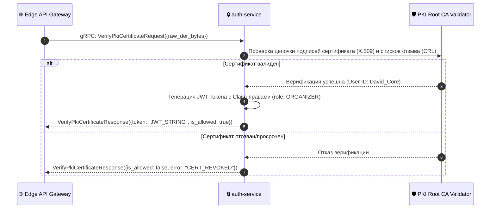

# 🔒 SPECIFICATION: AUTH SERVICE / СЕРВИС АВТОРbackground ИЗ-ЗА PKI

[English version below]

## 🇷🇺 РУССКАЯ ВЕРСИЯ
Микросервис `auth-service` (Порт `:8082`) представляет собой бронированный gRPC-компонент плоскости безопасности, осуществляющий проверку b2b корпоративных PKI-сертификатов и генерацию JWT-токенов доступа [2.1].

### 📊 Диаграмма сквозной верификации ролей (Auth Pipeline):

---

## 🇺🇸 ENGLISH VERSION
The `auth-service` cryptographic security shield (Port `:8082`) manages machine-to-machine validation of zero-trust PKI identities via gRPC [2.1].

* **Symmetric Assertion**: Compiles claims into encrypted JSON Web Tokens, letting edge nodes perform nanosecond access filtering.
* **X.509 Conformity**: Validates binary DER encoding layers straight against system keystores to guarantee enterprise access compliance.
