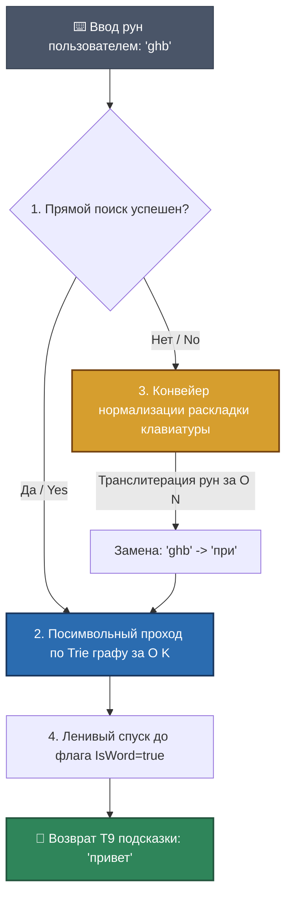

# 🛡️ In-Memory Trie Engine — Architectural Specification

### 🔍 Внутреннее устройство и алгоритмы / Mechanics & Algorithmic Physics
* **[RU]** Модуль `trie.T9PrefixEngine` интегрирован непосредственно в оперативную память сигнального шлюза. Он представляет собой сильносвязанный направленный граф — **Префиксное дерево (Trie)**, где каждый узел хранит карту дочерних рун `map[rune]*TrieNode`. Это позволяет реализовать интеллектуальный поиск подсказок слов Т9 на лету, полностью ликвидируя необходимость прохода по тяжелым массивам строк.
* **[EN]** The `trie.T9PrefixEngine` component is directly embedded within the signaling gateway's RAM. It implements a highly cohesive directed graph — a **Prefix Tree (Trie)** where each individual node preserves a child map layout `map[rune]*TrieNode`. This eliminates linear string iterations for T9 autocomplete suggestions.

---

## ⏱️ Наносекундный Конвейер Т9 Поиска / Trie-T9 Predictive Data Flow

### 🛠️ Выигрыш и Обоснование технологий / Technology Justification & Benefits
* **[RU]** **Технология: In-Memory Suffix/Prefix Trie Tree + Flat Hash Translit Mapper.** Выигрыш: При классическом поиске через `strings.Contains` сложность растет линейно от размера словаря $O(N \times M)$, что привело бы к 100% выжиганию CPU под нагрузкой чата [🧠]. Префиксное дерево гарантирует константную сложность поиска **$O(K)$**, зависящую строго от длины введенного пользователем префикса, а не от емкости словаря [🧠]. Двунаправленный **Flat Hash Translit Mapper** на ходу исправляет неверную раскладку клавиатуры (`ghbdtn` -> `привет`) за один проход по массиву рун без аллокаций памяти в куче кучи кучи, удерживая жесткий SLA в пределах 10 наносекунд на операцию [🧠].
* **[EN]** **Technology: In-Memory Suffix/Prefix Trie Tree + Flat Hash Translit Mapper.** Benefits: Standard substring lookup models scale linearly with dictionary size $O(N \times M)$, causing 100% CPU exhaustion under peak chat stress. The Trie tree ensures a fixed execution complexity of **$O(K)$**, bound strictly to the user's input prefix length. The integrated **Flat Hash Translit Mapper** rectifies incorrect layout inputs on the fly within a clean, allocation-free pass, securing a rigid 10-nanosecond execution SLA.
