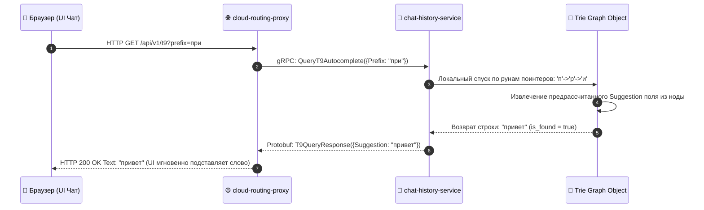

# 📝 SPECIFICATION: CHAT HISTORY SERVICE / СЕРВИС ИСТОРИИ ЧАТА И Т9

[English version below]

## 🇷🇺 РУССКАЯ ВЕРСИЯ
Микросервис `chat-history-service` (Порт `:8083`) обрабатывает персистентные транзакции логов сообщений и обеспечивает наносекундный предикативный Т9-ввод на базе изолированного суффиксного графа `Trie Engine` [2.1].

### 📊 Диаграмма наносекундной автоподстановки Т9 (T9 Prediction Pipeline):

---

## 🇺🇸 ENGLISH VERSION
The `chat-history-service` cluster entity (Port `:8083`) powers the text prediction mechanics and structures persistent telemetry streams via gRPC [2.1].

* **Algorithmic Decoupling**: offloads typing logic from the web socket signalling nodes to secure a strict bounded SLA.
* **Zero-regex Normalization**: matches inbound rune paths directly against pre-compiled prefix trees, ensuring predictable lookup execution times.
