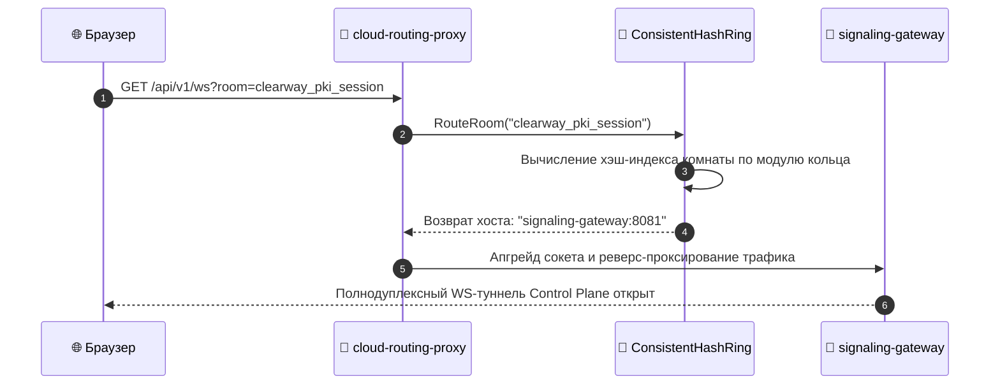

# 🌐 SPECIFICATION: CLOUD ROUTING PROXY / АРХИТЕКТУРА API GATEWAY

[English version below]

## 🇷🇺 РУССКАЯ ВЕРСИЯ
Микросервис `cloud-routing-proxy` (Порт `:8080`) является единой точкой входа (Ingress) в кластер и выполняет функции L7-балансировщика на базе кольца консистентного хэширования (`Consistent Hash Ring`) [2.1].

### 📐 Схема распределения трафика и маршрутизации комнат:
```text
  [HTTP/WS Request] ➔ /api/v1/ws?room=clearway_pki_session
                             │
                             ▼
                 [Consistent Hash Ring]
           ┌─────────────────┼─────────────────┐
           ▼                 ▼                 ▼
   [Node: gateway-1] [Node: gateway-2] [Node: gateway-3]
```

### 📊 Диаграмма последовательности вызовов (Proxy Routing Pipeline):


---

## 🇺🇸 ENGLISH VERSION
The `cloud-routing-proxy` microservice (Port `:8080`) operates as an edge Ingress node driven by a high-availability Consistent Hash Ring layout [2.1].

* **Zero-Downtime Re-routing**: shard index evaluation assigns room IDs to live gateway target containers dynamically.
* **REST & WS Isolation**: decoupled HTTP routes seamlessly handshake incoming metadata packets before forwarding them into internal bridge vectors.
