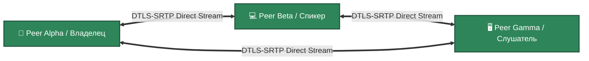

# 💻 Direct Media Plane (P2P Mesh) — Architectural Specification

### 🔍 Внутреннее устройство и физика сети / Peer-to-Peer Subsystem Mechanics
* **[RU]** Платформа полностью отказывается от использования централизованных медиа-серверов архитектуры SFU/MCU. Вместо этого полезная нагрузка User Plane (аудио, видео, потоки координат рисования) циркулирует строго **напрямую между браузерами участников конференции по зашифрованным P2P-туннелям (протоколы DTLS-SRTP)**.
* **[EN]** The platform entirely bypasses centralized media-server architectures like SFU or MCU. Instead, user-plane payload streams (audio, video, vector drawing coordinate telemetry) circulate strictly **peer-to-peer via encrypted DTLS-SRTP tunnels**.

---

## ⏱️ Схема Прямого Распределения Трафика / Full-Mesh Media Plane Layout

### 🛠️ Выигрыш и Обоснование технологий / Technology Justification & Benefits
* **[RU]** **Технология: Full-Mesh Topology + Client-Side Distributed Recording (MediaRecorder API).** Выигрыш: Декодирование, микширование и склейка медиа-потоков — это сложнейшие математические операции, требующие гигабайт RAM и десятков ядер CPU [🧠]. Перенос этой логики на сторону клиентов по топологии Mesh снижает нагрузку на наш сервер до **0% CPU / 0 B RAM на трансляцию медиа** [🧠]! Паттерн **Client-Side Recording** заставляет браузер модератора локально писать холст конференции через `MediaRecorder API` на паузах, после чего готовый файл `.mp4` асинхронно заливается в объектный b2b-склад, полностью страхуя одноядерный инстанс нашего сервера от краха по OOM [🧠].
* **[EN]** **Technology: Full-Mesh Topology + Client-Side Distributed Recording (MediaRecorder API).** Benefits: Decoding, mixing, and merging media matrixes are resource-expensive operations demanding gigabytes of RAM. Shifting this infrastructure logic to the client side via a Full-Mesh model drops server load boundaries down to **0% CPU / 0 B RAM for media transport**. The **Client-Side Recording** pattern enforces the moderator's browser to stream canvas inputs directly into local `.mp4` files via the native `MediaRecorder API`, completely shielding single-core node instances from Out-of-Memory (OOM) failures.
