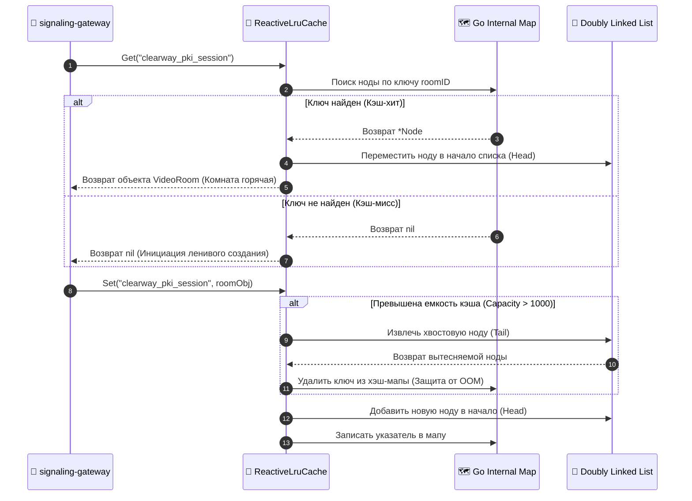

# 🧪 FUNCTION SPECIFICATION: REACTIVE LRU CACHE / РЕАКТИВНЫЙ LRU-КЭШ

## 🇷🇺 РУССКАЯ ВЕРСИЯ
Компонент `internal/pkg/trie/lru.go` реализует реактивный LRU (Least Recently Used) кэш комнат. Предназначен для удержания горячих стейтов комнат в ОЗУ со сложностью операций \(O(1)\) [1.1].

### Схема структуры ОЗУ и связанных указателей:
```text
  Хэш-мапа (Go Map): [roomID] ➔ Указатель на ноду (*Node)
   │
   ▼
  Двусвязный список (Doubly Linked List):
  [ Head (Самая свежая комната) ] ⇄ [ Node 1 ] ⇄ [ Node 2 ] ⇄ [ Tail (Устаревшая комната) ]
```

### Диаграмма вызовов при обращении к кэшу (Eviction Pipeline):


---

## 🇺🇸 ENGLISH VERSION
Component `internal/pkg/trie/lru.go` implements an $O(1)$ Reactive LRU Cache combining a hash map for microsecond lookup and a Doubly Linked List for atomic memory evictions.

* Accessing an existing room pointer dynamically shifts its position to the `Head` node.
* Boundary overflow forces the scheduler to delete the `Tail` node, purging memory leaks.
