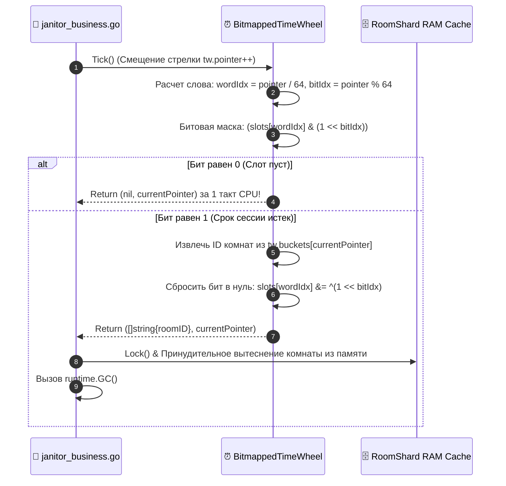

# ⏰ FUNCTION SPECIFICATION: BITMAPPED TIME WHEEL / БИТОВОЕ КОЛЕСО ВРЕМЕНИ ТАЙМАУТОВ

## 🇷🇺 РУССКАЯ ВЕРСИЯ
Компонент `internal/pkg/timewheel/tw.go` реализует 300-битный безэлокационный планировщик таймаутов, инкапсулированный в массив `[5]uint64` [1.1].

### Архитектура регистров битовой маски в ОЗУ:
```text
  Индекс слова = Слот / 64
  Индекс бита  = Слот % 64
  
  [tw.slots] ➔ [ uint64 Word 0 ] ➔ [0100000000...00] (Бит 1 взведен ➔ 1-я минута активна)
                 [ uint64 Word 1 ]
                 [ uint64 Word 2 ]
```

### Диаграмма жизненного цикла тиков Janitor-демона ($O(1)$):


---

## 🇺🇸 ENGLISH VERSION
Component `internal/pkg/timewheel/tw.go` delegates session expiration tasks to raw bitwise operations.

* Addition sets the exact offset bit via `|= (1 << bitIdx)`.
* Every minute the janitor evaluates the active word block via atomic bit masking, triggering zero allocations if no sessions expired.
