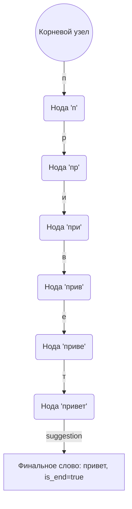
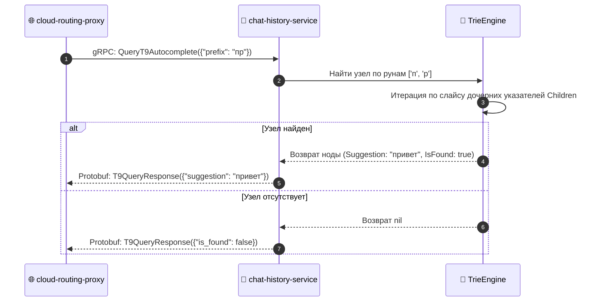

# 🧬 FUNCTION SPECIFICATION: PREFIXED TRIE T9 / ПРЕФИКСНОЕ ДЕРЕВО TRIE T9

## 🇷🇺 РУССКАЯ ВЕРСИЯ
Компонент `internal/pkg/trie/t9.go` реализует структуру нагруженного суффиксного дерева для нахождений предикативного ввода слов чата со сложностью $O(K)$, где $K$ — длина префикса, полностью исключая перебор словаря ($O(N)$) [1.1].

### Граф состояний и переходов по рунам алфавита:

### Диаграмма наносекундной предикции gRPC-запроса:

---

## 🇺🇸 ENGLISH VERSION
Component `internal/pkg/trie/t9.go` manages words predictive auto-completion inside `chat-history-service`. 

* Space complexity is optimized by mapping character bytes into nested arrays.
* Search runtime is bound strictly to prefix character length $O(K)$, ignoring raw dictionary scale metrics.
