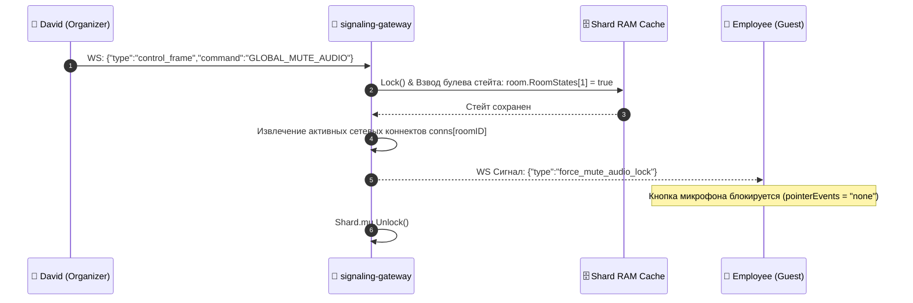

# 🎰 SPECIFICATION: SIGNALING GATEWAY / ШЛЮЗ СИГНАЛИЗАЦИИ WEBRTC

[English version below]

## 🇷🇺 РУССКАЯ ВЕРСИЯ
Микросервис `signaling-gateway` (Порт `:8081`) управляет Control Plane сопряжением WebRTC-нод, контролирует лимиты емкости комнат (PCEF) и координирует лекционные блокировки треков медиа-трафика [2.1].

### 📐 Схема Full-Mesh сигнализации комнат:
```text
                       ┌─────────────────────┐
                       │  signaling-gateway  │
                       └──────────┬──────────┘
                  WebSocket       │       WebSocket
            ┌─────────────────────┴─────────────────────┐
            ▼                                           ▼
  [David (Organizer)] <--------- User Plane ---------> [Employee (Guest)]
                         (Direct WebRTC Video)
```

### 📊 Диаграмма оркестрации лекционных режимов (Orchestration Pipeline):


---

## 🇺🇸 ENGLISH VERSION
The `signaling-gateway` core engine (Port `:8081`) translates orchestrational events into real-time WebRTC connectivity matrices [2.1].

* **Thread-Safe Partitioning**: Cluster partitions room sessions into 32 isolated sharded mutex vectors (`RoomShard`), reducing resource contention.
* **Mute States Preservation**: Dynamic room maps record active track lock variables, instantly silencing newly connecting guest entities upon joining.
