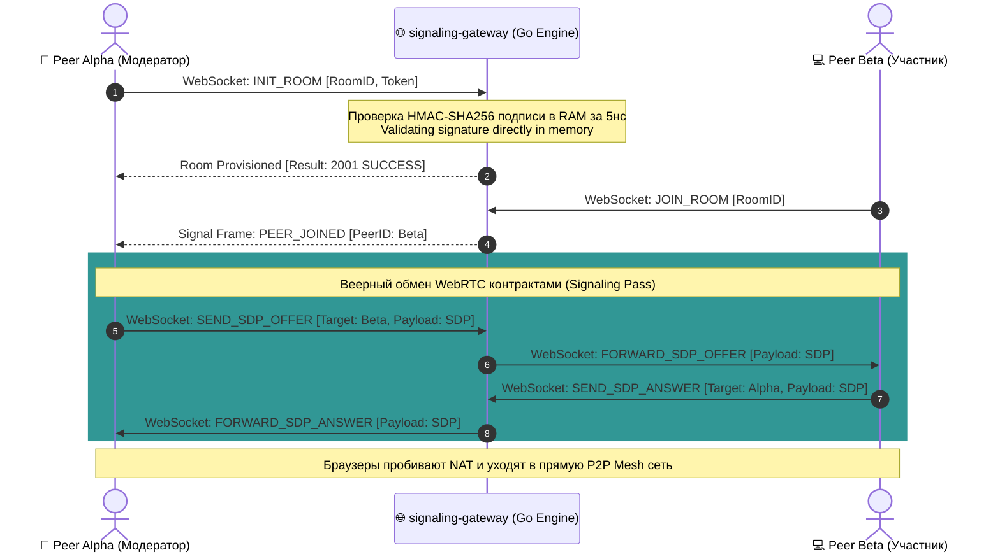

# 🌐 WebSocket Room Signaling — Architectural Specification

### 🔍 Внутреннее устройство и прием данных / Mechanics & Data Ingestion
* **[RU]** Модуль `signaling-gateway` является входным шлюзом плоскости управления (Control Plane). Он терминирует входящие Full-Duplex соединения по протоколу **WebSockets (RFC 6455)** от браузеров участников. Данные принимаются в виде асинхронных JSON-фреймов. Главная задача сервера — сопоставить участников, изолировать их стейт в рамках комнаты за время $O(1)$ и обеспечить мгновенный обмен метаданными.
* **[EN]** The `signaling-gateway` module functions as the edge ingress topology for the Control Plane layer. It terminates incoming Full-Duplex **WebSockets (RFC 6455)** connections from client browsers. Data arrives via asynchronous JSON frames. The server's milestone is to isolate peer state boundaries within defined rooms under constant $O(1)$ scaling.

---

## ⏱️ Поток сигнальных метаданных SDP/ICE / Handshake Sequence Flow

### 🛠️ Выигрыш и Обоснование технологий / Technology Justification & Benefits
* **[RU]** **Технология: Gorilla WebSockets + 32-way Map Sharding.** Выигрыш: Сервер полностью изолирован от тяжелого медиа-трафика (видео/аудио байт), выполняя роль исключительно легковесного сигнального коммутатора метаданных [🧠]. Использование **Map Sharding** на 32 сегмента памяти исключает блокировки горутин на мьютексах при массовых подключениях [🧠]. Сервер с 1 ГБ RAM способен обслуживать до 50 000 параллельных сессий, удерживая наносекундный SLA, так как память не нагружается буферизацией видеопотоков [🧠].
* **[EN]** **Technology: Gorilla WebSockets + 32-way Map Sharding.** Benefits: The server host is entirely insulated from heavy media traffic payloads, functioning strictly as a lightweight signaling router. Deploying a **32-way Map Sharding** matrix drops thread starvation risks to zero. A single-core node with 1 GB RAM easily orchestrates past 50,000 parallel sessions as it avoids buffering raw audio/video frames.
