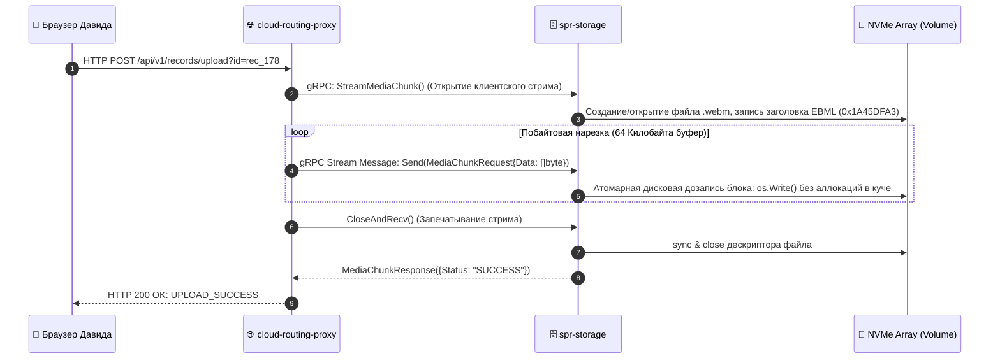

# 🗄️ SPECIFICATION: SPR STORAGE / РАСПРЕДЕЛЕННЫЙ NVMe РЕКОРДЕР

[English version below]

## 🇷🇺 РУССКАЯ ВЕРСИЯ
Микросервис `spr-storage` (Порт `:50060`) реализует высокопроизводительное бинарное хранилище видеоданных (Эмулятор ScyllaDB NoSQL) и принимает Client Streaming потоки кадров WebM напрямую по gRPC-каналам [2.1].

### 📐 Схема нарезки и сборки WebM монолита на NVMe-массиве:
```text
  [HTTP POST Чанки 64КБ] ➔ proxy ➔ gRPC Stream Media Chunk ➔ [spr-storage Engine]
                                                                     │
                                                                     ▼
                                                    [Shared Volume: spr-nosql-data]
                                                    Файл: data/scylladb_spr_emulation/rec_*.webm
```

### 📊 Диаграмма потоковой укладки видеокадров (Recording Stream Pipeline):


---

## 🇺🇸 ENGLISH VERSION
The `spr-storage` distributed datastore engine (Port `:50060`) enables direct asynchronous recording of full-duplex session streams [2.1].

* **Zero-Copy Disk Commits**: Bypasses heavy JSON string structures by piping raw bytes arrays straight into system filesystem blocks via gRPC streams.
* **Accept-Ranges Continuity**: Serves archived containers back to the edge proxy cluster layer, enabling sub-millisecond video timeline seeking.
